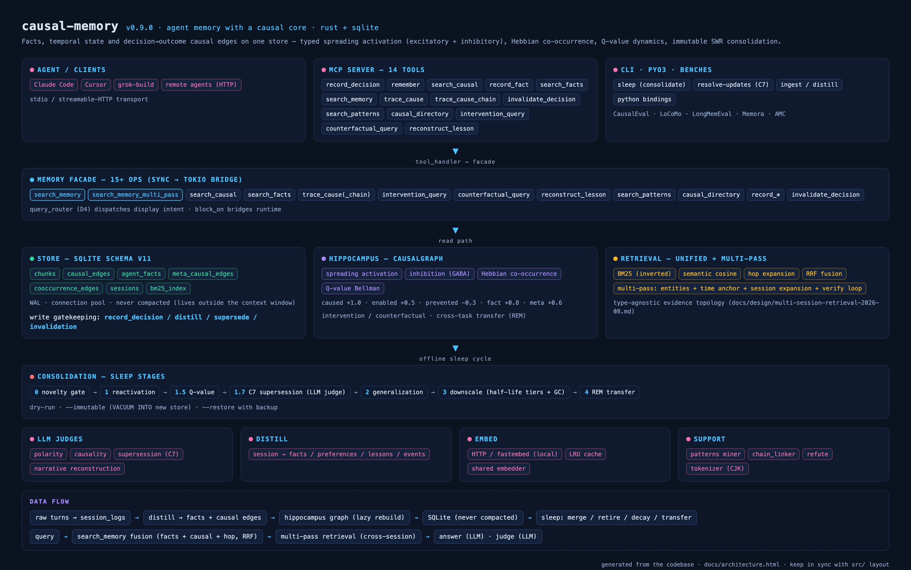

# causal-memory

> **An agent memory system with a causal core — and the only one that models inhibition.**
>
> Facts, temporal state, and `decision → outcome` causal edges on one SQLite store,
> powered by a hippocampus-style engine: typed spreading activation (excitatory
> *and* inhibitory), Hebbian co-occurrence reinforcement, Q-value dynamics, and
> immutable SWR consolidation. Agents recall *what* happened, *when* it was true,
> *why* it worked — and *what would happen if* they acted differently.

[](LICENSE)
[](#status)
[](#build--test)
[](https://github.com/JingxuanC/causal-memory/releases)

---

## Why

Every agent forgets *why* it made past decisions after a few context compactions.
It re-fixes the same bug the same wrong way, re-debates the same architecture
choice, relearns the same lesson.

This happens because **causal information is the most fragile type under text
compaction**. Real-LLM benchmark (grok-build's production compaction prompt):

| Compactions (k) | Textual recall | Causal-table recall |
|---|---|---|
| 1 | 100% | 100% |
| 2 | 85% | 100% |
| 3 | 55% | 100% |
| 5 | **45%** | **100%** |

The causal table survives because it lives **outside the agent's context window** —
compaction cannot touch it.

---

## Demo

21 秒实操演示（真实记忆库，非 mock）：行动前预警（`intervention_query` → DANGER 链）
→ 经验检索（`search_causal`）→ 反事实对比（`counterfactual_query`）→
写入闭环（`record_decision` → 立即可检索）。

<video src="https://github.com/JingxuanC/causal-memory/raw/main/docs/demo/causal-memory-demo.mp4" controls width="720"></video>

[下载视频](docs/demo/causal-memory-demo.mp4) ·
[预警场景截图](docs/demo/demo_intervention.png) ·
[品牌卡](docs/demo/demo_card.png) ·
重新生成：`scripts/render_demo.py`

---

## Benchmarks

### CausalEval — the causal memory benchmark (primary)

Most agent-memory benchmarks (LoCoMo, LongMemEval, Memora) test **fact recall**
("what is the user's preference"). causal-memory's differentiators — typed
causal edges, inhibition, intervention prediction, cross-task transfer — are
invisible on those suites. **CausalEval** measures them.

**Design: the causal graph is the answer key.** Typed DAGs are generated
deterministically; conversations are narrated from the graph; gold answers are
derived from graph structure — zero hand annotation, zero ambiguity.

**CausalEval v13 (soft supersession) — 140 questions, 20 graphs** (same LLM,
same judge; v12 baseline was 70q/10 graphs; mem0 comparison ran on the 70q
protocol):

| Capability | causal-memory | v12 (70q) | mem0 (70q) | What it tests |
|---|---|---|---|---|
| **C7 Update** | **100%** | 50% | 80% | Supersede old belief after falsification (soft `superseded_by` annotation) |
| C3 Counterfactual | **95%** | 90% | 80% | Choosing between alternatives with known outcomes |
| C2 Intervention | **75%** | 70% | 40% | Forward prediction: "if X again, what happens?" |
| C4 Inhibition | **80%** | 90% | 50% | Distinguishing root-cause fix vs blast-radius limiter (`prevented` edges) |
| C1 Attribution | 85% | 90% | 90% | Backward causal chain → root cause |
| C5 Temporal-causal | 90% | 100% | 90% | Ordering on a causal chain |
| C6 Lesson transfer | 20% | 20% | 30% | Cross-task analogy via meta edges (open limitation) |
| **Overall** | **78%** | 81% | 65% | |

**Key result: C7 update 50% → 100% (+50pp, 20/20 questions) and it holds at
doubled sample size.** Soft supersession annotates superseded edges
(`superseded_by`) instead of hiding them — the falsification signal reaches
the answer model while the old lesson stays retrievable for counterfactuals
(C3 unharmed at 95%). The C6 gap (20% vs mem0 30%) is the remaining open
limitation; C1/C4/C5 dips vs v12 are within re-distillation variance and
new-graph difficulty (v12 and v13 do not share a distilled corpus).

### Fact-recall benchmarks (not our strong suit)

On traditional fact-recall suites, causal-memory performs competitively but
**does not beat mem0** — this is expected, because fact recall is mem0's
specialty and not where causal-memory adds value.

| Benchmark | causal-memory | mem0 | Note |
|---|---|---|---|
| LoCoMo (strict judge) | 79.1% | 91.6% | mem0's home turf |
| LongMemEval-S (full pipeline, deepseek-chat) | **76.4%** @ 11.5K tok/q | 94.4% @ 6.8K tok/q (official) · 73.8% (ind. repro) | single-model stack vs platform stack; see docs/benchmarks/longmemeval.md |
| Memora MPA | 67.4% | 71.8% | −4.4pp |
| Compaction survival | 100% | 45% | External table = immune to compaction |
| Agent repeat-mistake | 33% | 67% | −34pp on trap-world |

### Capability tests (322 across the workspace)

These test capabilities that **no fact store (mem0, Zep, Letta) can offer**.

| Capability | What it proves | Tests |
|---|---|---|
| **Prevented-edge warning** | `prevented` edge spreads −0.3 activation (GABA analogue) | 2 |
| **Trace-cause attribution** | Backward CSR traversal finds root cause | 2 |
| **Multi-hop causal chain** | Forward K-hop spreading reaches 2-3 hop outcomes | 2 |
| **Inhibitory filtering** | Prevented outcomes appear as negative, not false positives | 1 |
| **Intervention comparison** | Same outcome has +0.9 for "skip tests" and −0.3 for "add tests" | 4 |
| **SWR consolidation** | LTP strengthens replayed edges, LTD weakens unvisited, GC forgets dormant | 5 |
| **Q-value dynamics** | Good decisions rank higher; Bellman propagates to parents | 3 |
| **Novelty entropy** | Diverse experience triggers consolidation; uniform does not | 3 |
| **Meta-edge mining** | Cross-session pattern discovery (similar_to / repeated) | 3 |
| **Hebbian co-occurrence** | Repeated co-activation strengthens connection | 3 |

---

## What makes it different

| Capability | causal-memory | mem0 | Zep | Letta | HeLa-Mem |
|---|---|---|---|---|---|
| Typed causal semantics (caused/enabled/prevented) | ✅ | ❌ | ❌ | ❌ | ❌ |
| **prevented negative spread (inhibitory)** | ✅ | ❌ | ❌ | ❌ | ❌ |
| Hebbian co-occurrence edges (excitatory) | ✅ | ❌ | ❌ | ❌ | ✅ |
| Immutable consolidation (delta + clone) | ✅ | ❌ | ❌ | ❌ | ❌ |
| Q-value dynamic utility | ✅ | ❌ | ❌ | ❌ | ❌ |
| Forward simulation (intervention_query) | ✅ | ❌ | ❌ | ❌ | ❌ |
| SWR offline consolidation (LTP/LTD/GC) | ✅ | ❌ | ❌ | ❌ | ❌ |
| Novelty-entropy consolidation trigger | ✅ | ❌ | ❌ | ❌ | ❌ |
| Meta-edge cross-session pattern mining | ✅ | ❌ | ❌ | ❌ | ❌ |
| Compaction survival evidence | ✅ +20.8pp | ❌ | ❌ | ❌ | ❌ |
| One graph unifying all memory types | ✅ | ❌ | ⚠️ | ❌ | ⚠️ |
| Write-time gatekeeping (raw → session_logs) | ✅ | ✅ | ❌ | ❌ | ❌ |
| Local ONNX embedding (offline) | ✅ | ✅ | ❌ | ❌ | ❌ |

**Core innovation: the excitatory/inhibitory duality.** HeLa-Mem (ACL 2026) builds
the excitatory side (Hebbian co-activation, positive spread). causal-memory adds
the inhibitory side (`prevented` edges spread **negative** activation — a GABA
analogue). A complete memory needs both: "what caused this" *and* "what prevents
this from happening again."

---

## Architecture



*Interactive version: [docs/architecture.html](docs/architecture.html)*

```
  ┌───────────────────────────────────────────────┐
  │           causal-memory (Rust, MCP)            │
  │                                                │
  │  14 tools ← Agent (stdio / HTTP)                 │
  │    ↓                                           │
  │  Write-time gatekeeping                        │
  │    raw turns → session_logs (audit only)       │
  │    distill → facts + causal edges (searchable) │
  │    ↓                                           │
  │  Unified retrieval (RRF fusion)                │
  │    BM25 + semantic cosine → RRF merge          │
  │    Fact layer (BM25 + embeddings)              │
  │    ↓                                           │
  │  ┌──── Hippocampus engine ──────────────────┐  │
  │  │ CSR graph + spreading activation          │  │
  │  │  caused (+1.0)   enabled (+0.5)           │  │
  │  │  prevented (−0.3) ← GABA inhibitory       │  │
  │  │  fact (+0.8)     meta (+0.6)              │  │
  │  │  co_occurrence (Hebbian, dynamic)         │  │
  │  │                                            │  │
  │  │ DG: SimHash pattern separation             │  │
  │  │ CA3: K-hop spreading (forward + reverse)   │  │
  │  │ CA1: Novelty entropy trigger               │  │
  │  │ SWR: LTP/LTD/GC (immutable delta + clone)  │  │
  │  │ Q-value: Bellman dynamics (MemRL-style)    │  │
  │  └────────────────────────────────────────────┘  │
  │    ↓                                           │
  │  SQLite (causal.db) — never compacted          │
  └───────────────────────────────────────────────┘
```

The `causal_edges` table is never compacted — it lives outside the agent's context
window. That's the entire point.

---

## Edge types

| Edge type | Spread coeff | Biological analogue | Meaning |
|---|---|---|---|
| `caused` | +1.0 | Glutamate (strong excitatory) | "Doing X caused Y" |
| `fact` | +0.8 | Semantic association | "User is/has Z" |
| `meta` | +0.6 | Cortical top-down | Cross-task pattern link |
| `enabled` | +0.5 | Weak excitatory | "Doing X enabled Y" |
| `co_occurrence` | dynamic | Hebbian LTP | "X and Y frequently co-occur" |
| **`prevented`** | **−0.3** | **GABA (inhibitory)** | **"Doing X prevented Y"** |
| `no_effect` | 0.0 | — | No causal relationship |

---

## Quick start

```bash
git clone https://github.com/JingxuanC/causal-memory.git
cd causal-memory
cargo build --release
```

### MCP integration (Claude Code, Cursor, grok-build, etc.)

```json
{
  "mcpServers": {
    "causal-memory": {
      "command": "/path/to/causal-memory/target/release/causal-memory",
      "env": {
        "CAUSAL_MEMORY_DB": "~/.local/share/causal-memory/causal.db"
      }
    }
  }
}
```

### HTTP transport (remote agents, multi-agent shared memory)

```bash
./target/release/causal-memory http --port 9938   # MCP Streamable HTTP
```

### With local embeddings (no API key needed)

```bash
cargo build --release --features local-embed
# Uses BAAI/bge-small-en-v1.5 (384 dims, ~130MB, downloads once then offline)
```

### With HTTP embeddings (OpenAI/ZhiPu/etc.)

```bash
export CAUSAL_MEMORY_EMBED_API=https://open.bigmodel.cn/api/paas/v4
export CAUSAL_MEMORY_EMBED_KEY=your-key
export CAUSAL_MEMORY_EMBED_MODEL=embedding-3
```

### Python bindings (PyO3)

All 14 memory operations are also available as a Python package, built on the
same `causal_memory::memory::Memory` facade the MCP server uses:

```bash
cd crates/causal-memory-py
pip install maturin
maturin develop          # builds and installs into the active venv
```

```python
from causal_memory import CausalMemory

mem = CausalMemory("~/.local/share/causal-memory/causal.db")  # or CausalMemory.in_memory()
mem.record_decision("used Redis mutex for cache stampede protection",
                    "deadlock under load", "caused", "concurrency")
print(mem.search_causal(query="cache stampede protection"))
print(mem.intervention_query("skip the test suite before shipping"))
```

Methods mirror the 14 MCP tools one-to-one and return the same text. Embedding
and LLM features use the same `CAUSAL_MEMORY_EMBED_*` / `CAUSAL_MEMORY_LLM_*`
environment variables; without them the bindings degrade gracefully to
BM25-only retrieval. Smoke tests: `maturin develop && pytest tests/`.

> **macOS note:** always build the bindings through maturin. Plain
> `cargo build -p causal-memory-py --release` fails to link — the Xcode CLT
> Python ships no `libpython3.9` dylib (this is why the py crate sits outside
> the workspace `default-members`).

---

## Fourteen MCP tools

| Tool | When to call | What it does |
|---|---|---|
| `record_decision` | After acting on a decision | Logs `decision → outcome` as a causal edge with relation type |
| `remember` | After any meaningful exchange | Zero-friction alternative: paste conversation text, LLM auto-extracts facts/lessons/causal edges |
| `search_causal` | Before a non-trivial decision | BM25 + semantic retrieval of past causal episodes |
| `record_fact` | When learning a stable fact | Records flat facts with scope + confidence; idempotent |
| `search_facts` | When you need "what is" info | BM25 + semantic retrieval over the fact layer |
| `search_memory` | When unsure which type | Unified: facts + causal lessons fused by RRF |
| `trace_cause` | When something fails | Single-hop reverse: which decision caused this outcome |
| `trace_cause_chain` | Deep failure analysis | Multi-hop backward traversal through the causal graph |
| `invalidate_decision` | When a lesson is wrong | Soft-invalidate (hidden from search, kept for audit) |
| `search_patterns` | To recall cross-task lessons | Mined meta edges: similar_to / repeated / contradicts / refines |
| `causal_directory` | Pinned in system prompt | L0 compact pointer list of what the agent knows |
| `intervention_query` | **Before taking an action** | Forward simulation: predicts outcomes (safe/warning/danger) |
| `counterfactual_query` | When choosing between options | Contrastive: compares recorded outcomes of two alternatives |
| `reconstruct_lesson` | When you want the distilled lesson | Reconstructive retrieval: Markov-blanket subgraph → coherent narrative, with optional N-way calibration |

---

## Sleep consolidation

```bash
causal-memory sleep --dry-run   # preview what would change
causal-memory sleep             # run consolidation cycle
```

Immutable SWR 2.0: produces a delta + clone (original graph untouched), with full
audit log. Triple-criterion GC (weak AND dormant AND zero-access). Triggers
automatically when novelty entropy exceeds threshold.

---

## Causal distill pipeline

The distiller extracts structured memories from raw conversations:

```
Raw conversation → V3 extraction prompt (130 lines, 6 rules, 5 few-shot)
                   ↓
  Fact/Preference → agent_facts table (BM25 + embedding searchable)
  Lesson/Event    → causal edges (self-referential, searchable)
  Causal          → proper directed edge: decision → outcome
                    with relation type (caused/enabled/prevented)
```

Raw turns go to `session_logs` (audit/replay only) — they never enter the
retrieval pool. This write-time gatekeeping keeps BM25 precision high.

---

## System layer coverage

All 16 designed layers have end-to-end validation (322 workspace tests):

| Layer | Benchmark | Tests |
|---|---|---|
| Fact layer | Memora / LoCoMo | — |
| Causal edges (caused/enabled/prevented) | Capability | 12 |
| Hippocampus spreading activation | Capability | — |
| SWR consolidation (LTP/LTD/GC) | Longitudinal | 5 |
| Q-value dynamics | Longitudinal | 3 |
| Novelty entropy trigger | Longitudinal | 3 |
| Sleep-wake cycle | Longitudinal | 1 |
| Meta-edge pattern mining | Advanced | 3 |
| Co-occurrence Hebbian | Advanced | 3 |
| Intervention query (forward sim) | Advanced | 4 |
| Trace cause chain | Capability | 2 |
| Inhibitory ablation | Inhibition | 2 |
| Distill / retrieval / facts | Memora / LoCoMo / LME | — |
| Compaction survival | Compact | — |
| Agent trap-world | Agent | — |
| Pipeline e2e | Migration / Pipeline | 2 |

---

## Build & test

```bash
cargo build --release                    # Build binary
cargo test --workspace --no-fail-fast  # Run 322 tests
cargo test --features local-embed     # Run with ONNX embedding tests
cargo clippy --workspace -- -D warnings # Lint
```

## Agent Memory Challenge (AMC/01)

causal-memory enters the [Agent Memory Leaderboard](https://agentmemories.ai/competition/)
first evaluation cycle via an Add/Search integration server — a thin HTTP
frontend over the same `Memory` facade the MCP server runs (BM25 + semantic +
entity retrieval, RRF-fused; one store per `user_id`):

```bash
cargo build --release --bin causal-memory-amc
./target/release/causal-memory-amc --db-dir amc_data --port 8787 --write-mode raw
# --write-mode raw (no LLM, platform default) | distill (write-time LLM extraction)
# POST /add (store memory, user_id-isolated) · POST /search (ordered evidence) · GET /health
```

Docker route: `docker build -t causal-memory-amc . && docker run -p 8787:8787 -v amc-data:/data causal-memory-amc`.
Submission details, method description, and the participation checklist live in
[`docs/benchmarks/amc-2026.md`](docs/benchmarks/amc-2026.md).

Test suite breakdown:
- **186** library unit tests (types, store, distill, patterns, hippocampus)
- **45** library integration tests (capability, longitudinal, advanced, pipeline)
- **91** CLI, benchmark-harness & MCP e2e tests

---

## Research background

Full documentation map: [`docs/README.md`](docs/README.md) — design docs,
benchmark protocols, evaluation reports, paper drafts, and the literature
survey.

This project is the engineering output of 17 research notes on agent memory
architecture ([insights/01-17](https://github.com/JingxuanC/agent-teardown/tree/main/insights)),
a teardown of 7 production agent frameworks, and deep analysis of 10+ memory
research papers. Key references:

- **HeLa-Mem** (ACL 2026) — Hebbian spreading activation (our closest competitor; we add the inhibitory side)
- **Anthropic Dreams API** — immutable consolidation pattern (aligned in SWR 2.0)
- **mem0** — write-time gatekeeping architecture (adopted: session_logs separation)
- **MemRL** (arXiv:2601.03192) — Q-value memory dynamics (implemented)
- **Graph World Models** — causal-memory maps to "Graph as Reasoner"

---

## Status

**v0.9.0 — alpha.**

What works (16/16 layers with end-to-end validation):

- ✅ 14 MCP tools (stdio + HTTP transport)
- ✅ Write-time gatekeeping (session_logs separation, V3 distill prompt)
- ✅ BM25 + semantic RRF unified retrieval
- ✅ Hippocampus engine: CSR spreading activation, DG SimHash, CA1 novelty, SWR 2.0
- ✅ 7 edge types: caused/enabled/prevented/fact/meta/co_occurrence/no_effect
- ✅ Causal distill: extracts typed causal edges (caused/enabled/prevented) from conversations
- ✅ Hebbian co-occurrence reinforcement
- ✅ Q-value Bellman dynamics
- ✅ Novelty-entropy consolidation trigger + sleep-wake cycle
- ✅ Meta-edge cross-session pattern mining
- ✅ Forward simulation (intervention_query) with prevented-edge warnings
- ✅ Benchmark harnesses: LoCoMo, LongMemEval, Memora, CausalEval, compaction, agent ablation, capability, longitudinal, advanced
- ✅ C7 LLM update-resolver (resolve-updates CLI + sleep stage 1.7 supersession)
- ✅ Vela-style half-life decay tiers (90d / 7d / legacy 0.99-per-day)
- ✅ Multi-session multi-pass retrieval (LongMemEval multi-session 42.9% → 57.9%, same-codebase)
- ✅ PyO3 Python bindings (crates/causal-memory-py)
- ✅ DSH native plugin (dsh-plugin/) + architecture visualization (docs/architecture.html)
- ✅ 368/368 tests passing + clippy clean

What's not done yet:

- ❌ TS bindings
- ❌ Forward-simulation prediction-accuracy benchmark (designed, not yet run)
- ❌ 7×24 production deployment validation

## License

Apache-2.0. See [LICENSE](LICENSE).
