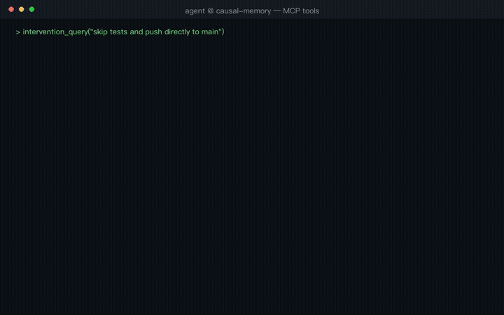

# causal-memory

> **一个以因果为核心的 agent 记忆系统——也是唯一对"抑制"建模的系统。**
>
> 在同一份 SQLite 存储上承载事实、时序状态与 `决策 → 结果` 因果边，
> 由海马体风格的引擎驱动：类型化扩散激活（兴奋性*与*抑制性）、
> Hebbian 共现强化、Q 值动力学、不可变 SWR 固化。Agent 能回忆*发生过什么*、
> *何时为真*、*为什么有效*——以及*换个做法会怎样*。

[](LICENSE)
[](#项目状态)
[](#构建与测试)
[](https://github.com/JingxuanC/causal-memory/releases)
[](hermes-plugin/)
[](dsh-plugin/)

[English](README.md) · **简体中文**

---

## 为什么做这个项目

每个 agent 在几次上下文压缩之后，都会忘记自己*当初为什么*做了那些决定。
它会用同样错误的方式重复修同一个 bug，重复争论同一个架构选择，
重复学习同一条教训。

根本原因是**因果信息在文本压缩下最脆弱**。真实 LLM 基准测试
（grok-build 的生产环境压缩 prompt）：

| 压缩次数 (k) | 文本回忆 | 因果表回忆 |
|---|---|---|
| 1 | 100% | 100% |
| 2 | 85% | 100% |
| 3 | 55% | 100% |
| 5 | **45%** | **100%** |

因果表能活下来，因为它存在 **agent 上下文窗口之外**——压缩碰不到它。

---

## 演示

21 秒实操演示（真实记忆库，非 mock）：行动前预警（`intervention_query` → DANGER 链）
→ 经验检索（`search_causal`）→ 反事实对比（`counterfactual_query`）→
写入闭环（`record_decision` → 立即可检索）。

<!-- GitHub 的 CSP（media-src）只放行 GitHub 自托管的媒体，外链 <video>
     在仓库页面上永远无法播放。动图 GIF 走 camo 图片代理，可以内联播放。
     点击查看 mp4。 -->
[](docs/demo/causal-memory-demo.mp4)

[下载视频](docs/demo/causal-memory-demo.mp4) ·
[预警场景截图](docs/demo/demo_intervention.png) ·
[品牌卡](docs/demo/demo_card.png) ·
重新生成：`scripts/render_demo.py`

---

## 基准测试

### CausalEval —— 因果记忆基准（主基准）

大多数 agent 记忆基准（LoCoMo、LongMemEval、Memora）测的是**事实回忆**
（"用户的偏好是什么"）。causal-memory 的差异化能力——类型化因果边、
抑制、干预预测、跨任务迁移——在这些套件上是不可见的。**CausalEval** 就是用来测它们的。

**设计：因果图即答案。** 类型化 DAG 确定性生成；对话由图结构叙述而来；
标准答案从图结构推导——零人工标注，零歧义。

**CausalEval v13（软取代）—— 140 题，20 张图**（同一 LLM、同一评判；
v12 基线为 70 题/10 图；mem0 对比跑在 70 题协议上）：

| 能力 | causal-memory | v12 (70题) | mem0 (70题) | 测的是什么 |
|---|---|---|---|---|
| **C7 更新** | **100%** | 50% | 80% | 证伪后取代旧信念（软 `superseded_by` 标注） |
| C3 反事实 | **95%** | 90% | 80% | 在已知结果的备选方案间做选择 |
| C2 干预 | **75%** | 70% | 40% | 前向预测："如果再做 X，会怎样？" |
| C4 抑制 | **80%** | 90% | 50% | 区分根因修复与爆炸半径限制（`prevented` 边） |
| C1 归因 | 85% | 90% | 90% | 回溯因果链 → 根因 |
| C5 时序因果 | 90% | 100% | 90% | 因果链上的时序排序 |
| C6 教训迁移 | 20% | 20% | 30% | 经 meta 边的跨任务类比（公开的已知局限） |
| **总分** | **78%** | 81% | 65% | |

**关键结果：C7 更新 50% → 100%（+50pp，20/20 题），且在样本量翻倍后依然成立。**
软取代用 `superseded_by` 标注被证伪的边而不是隐藏它们——证伪信号能到达
答案模型，同时旧教训仍可被反事实检索（C3 不受损，保持 95%）。
C6 差距（20% vs mem0 30%）是剩余公开局限；C1/C4/C5 相对 v12 的回落
在重蒸馏方差与新图难度的范围内（v12 与 v13 不共享蒸馏语料）。

### 事实回忆基准（非我们的强项）

在传统事实回忆套件上，causal-memory 有竞争力但**不优于 mem0**——
这是预期内的：事实回忆是 mem0 的主场，而不是 causal-memory 创造价值的地方。

| 基准 | causal-memory | mem0 | 备注 |
|---|---|---|---|
| LoCoMo（严格评判） | 79.1% | 91.6% | mem0 主场 |
| LongMemEval-S（完整流程，deepseek-chat） | **76.4%** @ 11.5K tok/q | 94.4% @ 6.8K tok/q（官方）· 73.8%（独立复现） | 单模型栈 vs 平台栈，见 docs/benchmarks/longmemeval.md |
| Memora MPA | 67.4% | 71.8% | −4.4pp |
| 压缩存活率 | 100% | 45% | 外部表 = 对压缩免疫 |
| Agent 重复犯错率 | 33% | 67% | trap-world 上 −34pp |

### 能力测试（全 workspace 共 322 个）

这些能力**任何事实型存储（mem0、Zep、Letta）都无法提供**。

| 能力 | 证明了什么 | 测试数 |
|---|---|---|
| **Prevented 边预警** | `prevented` 边扩散 −0.3 激活（GABA 类比） | 2 |
| **Trace-cause 归因** | 反向 CSR 遍历找到根因 | 2 |
| **多跳因果链** | 前向 K 跳扩散到达 2–3 跳外的结果 | 2 |
| **抑制性过滤** | 被阻止的结果呈现为负向，而非误报 | 1 |
| **干预对比** | 同一结果对"跳过测试"为 +0.9，对"补充测试"为 −0.3 | 4 |
| **SWR 固化** | LTP 强化被重放的边，LTD 削弱未访问的，GC 遗忘休眠的 | 5 |
| **Q 值动力学** | 好决策排名更高；Bellman 回传到父节点 | 3 |
| **新颖性熵** | 多样经验触发固化；单一经验不触发 | 3 |
| **Meta 边挖掘** | 跨会话模式发现（similar_to / repeated） | 3 |
| **Hebbian 共现** | 反复共激活强化连接 | 3 |

---

## 不同之处

| 能力 | causal-memory | mem0 | Zep | Letta | HeLa-Mem |
|---|---|---|---|---|---|
| 类型化因果语义（caused/enabled/prevented） | ✅ | ❌ | ❌ | ❌ | ❌ |
| **prevented 负扩散（抑制性）** | ✅ | ❌ | ❌ | ❌ | ❌ |
| Hebbian 共现边（兴奋性） | ✅ | ❌ | ❌ | ❌ | ✅ |
| 不可变固化（delta + clone） | ✅ | ❌ | ❌ | ❌ | ❌ |
| Q 值动态效用 | ✅ | ❌ | ❌ | ❌ | ❌ |
| 前向模拟（intervention_query） | ✅ | ❌ | ❌ | ❌ | ❌ |
| SWR 离线固化（LTP/LTD/GC） | ✅ | ❌ | ❌ | ❌ | ❌ |
| 新颖性熵固化触发 | ✅ | ❌ | ❌ | ❌ | ❌ |
| Meta 边跨会话模式挖掘 | ✅ | ❌ | ❌ | ❌ | ❌ |
| 压缩存活证据 | ✅ +20.8pp | ❌ | ❌ | ❌ | ❌ |
| 一张图统一所有记忆类型 | ✅ | ❌ | ⚠️ | ❌ | ⚠️ |
| 写入时把关（raw → session_logs） | ✅ | ✅ | ❌ | ❌ | ❌ |
| 本地 ONNX embedding（离线） | ✅ | ✅ | ❌ | ❌ | ❌ |

**核心创新：兴奋/抑制二元性。** HeLa-Mem（ACL 2026）构建了兴奋侧
（Hebbian 共激活、正向扩散）。causal-memory 补上了抑制侧
（`prevented` 边扩散**负**激活——GABA 类比）。完整的记忆两者都需要：
"是什么导致了这个"*以及*"是什么阻止了它再次发生"。

---

## 架构


*交互版：[docs/architecture.html](docs/architecture.html)*

```
  ┌───────────────────────────────────────────────┐
  │           causal-memory (Rust, MCP)            │
  │                                                │
  │  14 tools ← Agent (stdio / HTTP)                 │
  │    ↓                                           │
  │  Write-time gatekeeping                        │
  │    raw turns → session_logs (audit only)       │
  │    distill → facts + causal edges (searchable) │
  │    ↓                                           │
  │  Unified retrieval (RRF fusion)                │
  │    BM25 + semantic cosine → RRF merge          │
  │    Fact layer (BM25 + embeddings)              │
  │    ↓                                           │
  │  ┌──── Hippocampus engine ──────────────────┐  │
  │  │ CSR graph + spreading activation          │  │
  │  │  caused (+1.0)   enabled (+0.5)           │  │
  │  │  prevented (−0.3) ← GABA inhibitory       │  │
  │  │  fact (+0.8)     meta (+0.6)              │  │
  │  │  co_occurrence (Hebbian, dynamic)         │  │
  │  │                                            │  │
  │  │ DG: SimHash pattern separation             │  │
  │  │ CA3: K-hop spreading (forward + reverse)   │  │
  │  │ CA1: Novelty entropy trigger               │  │
  │  │ SWR: LTP/LTD/GC (immutable delta + clone)  │  │
  │  │ Q-value: Bellman dynamics (MemRL-style)    │  │
  │  └────────────────────────────────────────────┘  │
  │    ↓                                           │
  │  SQLite (causal.db) — never compacted          │
  └───────────────────────────────────────────────┘
```

`causal_edges` 表永不被压缩——它活在 agent 的上下文窗口之外。
这就是全部意义所在。

---

## 边类型

| 边类型 | 扩散系数 | 生物学类比 | 含义 |
|---|---|---|---|
| `caused` | +1.0 | 谷氨酸（强兴奋） | "做 X 导致了 Y" |
| `fact` | +0.8 | 语义关联 | "用户是/有 Z" |
| `meta` | +0.6 | 皮层自上而下 | 跨任务模式链接 |
| `enabled` | +0.5 | 弱兴奋 | "做 X 促成了 Y" |
| `co_occurrence` | 动态 | Hebbian LTP | "X 和 Y 频繁共现" |
| **`prevented`** | **−0.3** | **GABA（抑制）** | **"做 X 阻止了 Y"** |
| `no_effect` | 0.0 | — | 无因果关系 |

---

## 快速开始

```bash
git clone https://github.com/JingxuanC/causal-memory.git
cd causal-memory
cargo build --release
```

### MCP 集成（Claude Code、Cursor、grok-build 等）

```json
{
  "mcpServers": {
    "causal-memory": {
      "command": "/path/to/causal-memory/target/release/causal-memory",
      "env": {
        "CAUSAL_MEMORY_DB": "~/.local/share/causal-memory/causal.db"
      }
    }
  }
}
```

### HTTP 传输（远程 agent、多 agent 共享记忆）

```bash
./target/release/causal-memory http --port 9938   # MCP Streamable HTTP
```

同一端口的可观测性端点（**无鉴权——请勿暴露公网**）：

```
GET /metrics                    Prometheus 文本（RED + 召回指标）
GET /healthz / /readyz          存活 / 就绪（就绪会探测 store）
GET /debug/recall?query=...     现场执行一次召回，返回完整 JSON trace
                                （种子、各跳摘要、逐条结果的 provenance）
GET /debug/recalls              最近的召回审计记录（落库持久化，
                                schema v13 recall_audit 表，重启不丢）
```

stderr 结构化 JSON 日志：`CAUSAL_MEMORY_LOG_FORMAT=json`。

### 使用本地 embedding（无需 API key）

```bash
cargo build --release --features local-embed
# 使用 BAAI/bge-small-en-v1.5（384 维，约 130MB，下载一次后离线可用）
```

### 使用 HTTP embedding（OpenAI/智谱等）

```bash
export CAUSAL_MEMORY_EMBED_API=https://open.bigmodel.cn/api/paas/v4
export CAUSAL_MEMORY_EMBED_KEY=your-key
export CAUSAL_MEMORY_EMBED_MODEL=embedding-3
```

### Python 绑定（PyO3）

全部 14 个记忆操作也以 Python 包形式提供，构建于 MCP server 使用的
同一个 `causal_memory::memory::Memory` 外观之上：

```bash
cd crates/causal-memory-py
pip install maturin
maturin develop          # 构建并安装到当前 venv
```

```python
from causal_memory import CausalMemory

mem = CausalMemory("~/.local/share/causal-memory/causal.db")  # 或 CausalMemory.in_memory()
mem.record_decision("used Redis mutex for cache stampede protection",
                    "deadlock under load", "caused", "concurrency")
print(mem.search_causal(query="cache stampede protection"))
print(mem.intervention_query("skip the test suite before shipping"))
```

方法与 14 个 MCP 工具一一对应，返回相同文本。Embedding 与 LLM 特性
使用相同的 `CAUSAL_MEMORY_EMBED_*` / `CAUSAL_MEMORY_LLM_*` 环境变量；
没有它们时绑定会优雅降级为仅 BM25 检索。冒烟测试：
`maturin develop && pytest tests/`。

> **macOS 注意：** 务必通过 maturin 构建绑定。直接
> `cargo build -p causal-memory-py --release` 会链接失败——Xcode CLT
> 自带的 Python 没有 `libpython3.9` dylib（这也是 py crate 放在
> workspace `default-members` 之外的原因）。

---

## 集成

### Hermes memory provider

[hermes-plugin/](hermes-plugin/) 把 causal-memory 变成 Hermes 的即插即用
`MemoryProvider`——扁平事实 + `决策 → 结果` 因果教训，落在同一份本地
SQLite 上，按 profile 天然隔离（`<hermes_home>/causal-memory/causal.db`）。
已接好的 hook：系统提示词因果目录、带预算的 prefetch 召回、不阻塞轮次的
`sync_turn` 后台写入，以及 `hermes causal-memory stats` CLI。存储活在
上下文窗口之外，Hermes 的压缩碰不到它。安装与配置见
[hermes-plugin/README.md](hermes-plugin/README.md)。

### DeepSeek Harness（DSH）原生插件

[dsh-plugin/](dsh-plugin/) 把全部 16 个 causal-memory 工具以干净命名
（无 `mcp__` 前缀）挂到 DSH 的 `ctx.tools`，并注入一段系统提示词，
告诉模型何时查阅因果记忆库。零运行时依赖——JSON-RPC over stdio 直连
causal-memory 二进制。一行安装：
`dsh plugin --profile web add "$PWD/dsh-plugin"`（需要 `causal-memory` 二进制：
`pip install causal-memory`，或在仓库内 `cargo build --release`）。
详见 [dsh-plugin/README.md](dsh-plugin/README.md)。

---

## 十四个 MCP 工具

| 工具 | 何时调用 | 作用 |
|---|---|---|
| `record_decision` | 执行决策之后 | 把 `决策 → 结果` 记为带关系类型的因果边 |
| `remember` | 任何有意义的交流之后 | 零摩擦替代方案：粘贴对话文本，LLM 自动抽取事实/教训/因果边 |
| `search_causal` | 做非平凡决策之前 | BM25 + 语义检索过往因果片段 |
| `record_fact` | 学到稳定事实时 | 记录带 scope + confidence 的扁平事实；幂等 |
| `search_facts` | 需要"是什么"信息时 | 事实层上的 BM25 + 语义检索 |
| `search_memory` | 不确定该查哪类时 | 统一入口：事实 + 因果教训经 RRF 融合 |
| `trace_cause` | 出故障时 | 单跳反向：哪个决策导致了这个结果 |
| `trace_cause_chain` | 深度故障分析 | 因果图上的多跳反向遍历 |
| `invalidate_decision` | 教训有误时 | 软作废（检索中隐藏，保留审计） |
| `search_patterns` | 回忆跨任务教训时 | 挖掘出的 meta 边：similar_to / repeated / contradicts / refines |
| `causal_directory` | 钉在系统 prompt 里 | L0 紧凑指针列表：agent 都知道些什么 |
| `intervention_query` | **采取行动之前** | 前向模拟：预测结果（safe/warning/danger） |
| `counterfactual_query` | 在选项间抉择时 | 对比式：比较两个备选方案已记录的结果 |
| `reconstruct_lesson` | 想要蒸馏后的教训时 | 重构式检索：Markov 毯子图 → 连贯叙述，可选 N 路校准 |

---

## 睡眠固化

```bash
causal-memory sleep --dry-run   # 预览会有哪些变化
causal-memory sleep             # 执行固化周期
```

不可变 SWR 2.0：产出 delta + clone（原图不动），带完整审计日志。
三标准 GC（弱 AND 休眠 AND 零访问）。当新颖性熵超过阈值时自动触发。

---

## 因果蒸馏管线

蒸馏器从原始对话中抽取结构化记忆：

```
原始对话 → V3 抽取 prompt（130 行，6 条规则，5 个 few-shot）
           ↓
  Fact/Preference → agent_facts 表（BM25 + embedding 可检索）
  Lesson/Event    → 因果边（自指，可检索）
  Causal          → 真正的有向边：决策 → 结果
                    带关系类型（caused/enabled/prevented）
```

原始对话轮次进入 `session_logs`（仅审计/回放）——它们永远不进入
检索池。写入时把关让 BM25 精确率保持高位。

---

## 系统层覆盖

全部 16 个设计层都有端到端验证（322 个 workspace 测试）：

| 层 | 基准 | 测试数 |
|---|---|---|
| 事实层 | Memora / LoCoMo | — |
| 因果边（caused/enabled/prevented） | 能力 | 12 |
| 海马体扩散激活 | 能力 | — |
| SWR 固化（LTP/LTD/GC） | 纵向 | 5 |
| Q 值动力学 | 纵向 | 3 |
| 新颖性熵触发 | 纵向 | 3 |
| 睡眠-觉醒周期 | 纵向 | 1 |
| Meta 边模式挖掘 | 高级 | 3 |
| 共现 Hebbian | 高级 | 3 |
| 干预查询（前向模拟） | 高级 | 4 |
| Trace cause chain | 能力 | 2 |
| 抑制消融 | 抑制 | 2 |
| 蒸馏 / 检索 / 事实 | Memora / LoCoMo / LME | — |
| 压缩存活 | Compact | — |
| Agent trap-world | Agent | — |
| 管线 e2e | Migration / Pipeline | 2 |

---

## 构建与测试

```bash
cargo build --release                    # 构建二进制
cargo test --workspace --no-fail-fast  # 跑 322 个测试
cargo test --features local-embed     # 含 ONNX embedding 测试
cargo clippy --workspace -- -D warnings # Lint
```

## Agent Memory Challenge（AMC/01）

causal-memory 通过一个 Add/Search 集成 server 参加
[Agent Memory Leaderboard](https://agentmemories.ai/competition/)
首个评估周期——它是 MCP server 所用的同一个 `Memory` 外观之上的
一层薄 HTTP 前端（BM25 + 语义 + 实体检索，RRF 融合；每个 `user_id`
一份独立存储）：

```bash
cargo build --release --bin causal-memory-amc
./target/release/causal-memory-amc --db-dir amc_data --port 8787 --write-mode raw
# --write-mode raw（无 LLM，平台默认）| distill（写入时 LLM 抽取）
# POST /add（存记忆，按 user_id 隔离）· POST /search（有序证据）· GET /health
```

Docker 路线：`docker build -t causal-memory-amc . && docker run -p 8787:8787 -v amc-data:/data causal-memory-amc`。
提交细节、方法描述与参赛清单见
[`docs/benchmarks/amc-2026.md`](docs/benchmarks/amc-2026.md)。

测试套件分布：
- **186** 个库单元测试（types、store、distill、patterns、hippocampus）
- **45** 个库集成测试（能力、纵向、高级、管线）
- **91** 个 CLI、基准 harness 与 MCP e2e 测试

---

## 研究背景

完整文档地图：[`docs/README.md`](docs/README.md)——设计文档、
基准协议、评估报告、论文草稿与文献综述。

本项目是 17 篇 agent 记忆架构研究笔记
（[insights/01-17](https://github.com/JingxuanC/agent-teardown/tree/main/insights)）、
7 个生产级 agent 框架拆解、10+ 篇记忆研究论文深度分析的工程产出。
关键参考：

- **HeLa-Mem**（ACL 2026）—— Hebbian 扩散激活（最接近的竞品；我们补上了抑制侧）
- **Anthropic Dreams API** —— 不可变固化模式（在 SWR 2.0 中对齐）
- **mem0** —— 写入时把关架构（已采用：session_logs 分离）
- **MemRL**（arXiv:2601.03192）—— Q 值记忆动力学（已实现）
- **Graph World Models** —— causal-memory 对应 "Graph as Reasoner"

---

## 项目状态

**v0.9.2 —— alpha。**

已可用（16/16 层有端到端验证）：

- ✅ 14 个 MCP 工具（stdio + HTTP 传输）
- ✅ 写入时把关（session_logs 分离，V3 蒸馏 prompt）
- ✅ BM25 + 语义 RRF 统一检索
- ✅ 海马体引擎：CSR 扩散激活、DG SimHash、CA1 新颖性、SWR 2.0
- ✅ 7 种边类型：caused/enabled/prevented/fact/meta/co_occurrence/no_effect
- ✅ 因果蒸馏：从对话中抽取类型化因果边（caused/enabled/prevented）
- ✅ Hebbian 共现强化
- ✅ Q 值 Bellman 动力学
- ✅ 新颖性熵固化触发 + 睡眠-觉醒周期
- ✅ Meta 边跨会话模式挖掘
- ✅ 带 prevented 边预警的前向模拟（intervention_query）
- ✅ 基准 harness：LoCoMo、LongMemEval、Memora、CausalEval、压缩、agent 消融、能力、纵向、高级
- ✅ C7 LLM 更新裁决器（resolve-updates CLI + sleep 阶段 1.7 取代）
- ✅ Vela 风格半衰期衰减分层（90 天 / 7 天 / 旧版每日 0.99）
- ✅ 多会话多趟检索（LongMemEval multi-session 42.9% → 57.9%，同代码库）
- ✅ PyO3 Python 绑定（crates/causal-memory-py）
- ✅ Hermes memory-provider 插件（hermes-plugin/）
- ✅ DSH 原生插件（dsh-plugin/）+ 架构可视化（docs/architecture.html）
- ✅ 368/368 测试通过 + clippy 干净

尚未完成：

- ❌ TS 绑定
- ❌ 前向模拟预测准确率基准（已设计，未跑）
- ❌ 7×24 生产部署验证

## 许可证

Apache-2.0。见 [LICENSE](LICENSE)。
