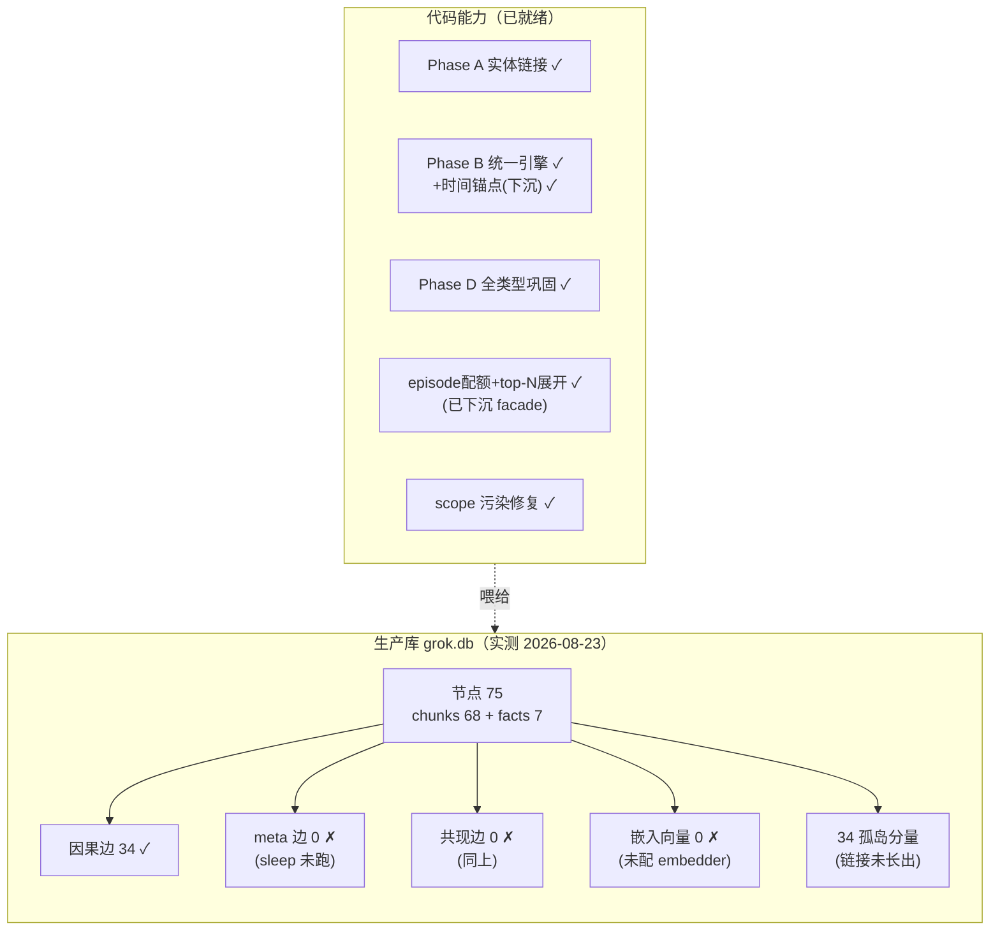

# 记忆图现状 —— 一张图搞定了吗 + 还差哪些

> 状态：实测快照（2026-08-23，git 5ff42c1）。数据源：生产库 `~/.local/share/causal-memory/grok.db`
> （MCP 正在使用）+ roadmap 逐项核对。配套：[long-term-vision.md](long-term-vision.md)（终态判据）、
> [one-graph-convergence.md](one-graph-convergence.md)（Phase A-D，已完成）。

## 0. 一句话

**架构上一张图已经搞定**——所有记忆类型都是图节点、一个引擎、写路径补丁、全类型巩固（Phase A-D 全上，
这两天又把 bench 验证的检索优化下沉到生产 facade）。但**生产库本身还很小很碎**：节点少、巩固循环
零运行、孤岛多。差距不在代码，在使用量。

## 1. 生产图实测（grok.db）

```
节点 75 = chunks 68 ──┬── 因果边 34（全部有效）
                      ├── facts 7（scope: user/agent）
                      ├── meta 边 0   ← sleep 从未执行
                      └── 共现边 0   ← 同上
嵌入向量 0             ← 未配 embedder
连通分量: 34 个孤岛（最大 2 节点）
```

对照：研究库 1,832 节点 / 17 分量 / 最大 1,777（北星文档 §6 数据）；LME 基准库 32 万节点。
生产库的孤岛形态 = entity_link_facts 需要 ≥3 distinct token 重叠，写入量不够时链接长不出来。



## 2. roadmap 剩余清单（逐项核对 2026-08-23）

**🟢 已完成**：fact 层 / Hebbian / SWR 2.0 / Q-value / 软取代 / Python bindings / HTTP /
RRF 融合 / **episode 配额 + top-N 展开 + 时间锚点（2026-08-23 下沉 facade）**

**🟡 半成**：Query routing 分类器（D4 已上，单层路由准确率未闭环验证）

**🔴 未动**：

| 组 | 项目 | 一句话 |
|---|---|---|
| 遗忘与巩固 | 三重 GC / 半衰期分档 / novelty 熵触发 / LLM 矛盾消解器 / meta 边撤销 | sleep 循环深化——生产库连第一次 sleep 都没跑 |
| 可解释与预算 | 激活轨迹输出 / L0-L2 分层加载 / token 预算参数 / flip-path 标记 | 北星⑥「为什么返回这条」 |
| 评测公信 | Memora 基准 / 正式消融（SWR/扩散/prevented）/ token 效率基准 | 「评测自证」欠账的解药 |
| 生态 | Hermes provider / TS bindings / L0 文件注入 / 团队记忆 / Dream 集成 / 多租户 / 备份 / 观测 / API 冻结 | 工程化长尾 |

## 3. 下一步排序（建议）

1. **让生产库活起来**：配 embedder（智谱已有 key）+ 定期 `sleep`——巩固/共现/meta 边立刻开始积累，
   孤岛随链接阈值自然消解。零代码，纯配置 + 习惯。
2. **Memora + 正式消融**：论文前置；消融同时回答「SWR/扩散/prevented 各贡献多少」。
3. **激活轨迹输出**：可解释性是当前最大的产品差距（每次检索能答「为什么返回这条」）。
4. 生态长尾按需求拉动，不主动排期。
