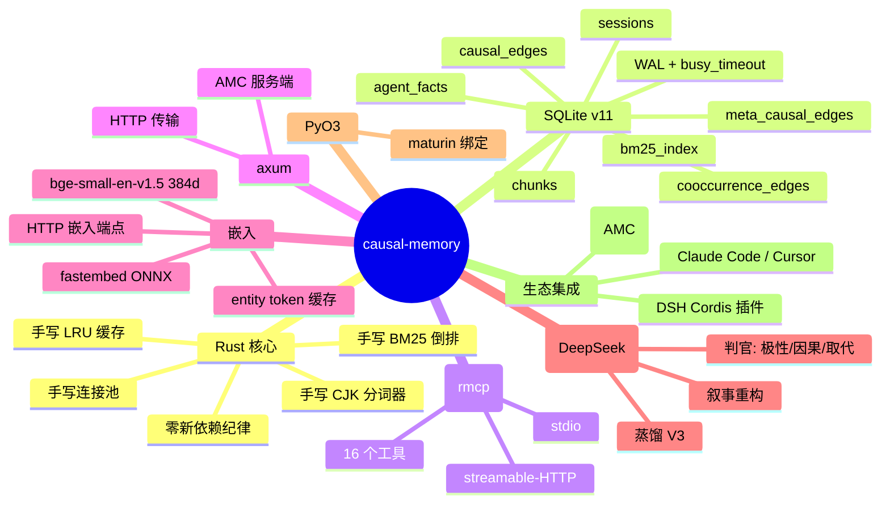
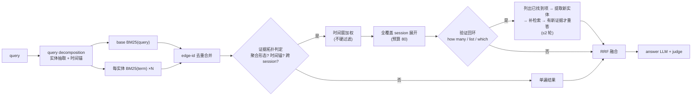
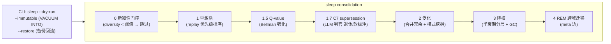
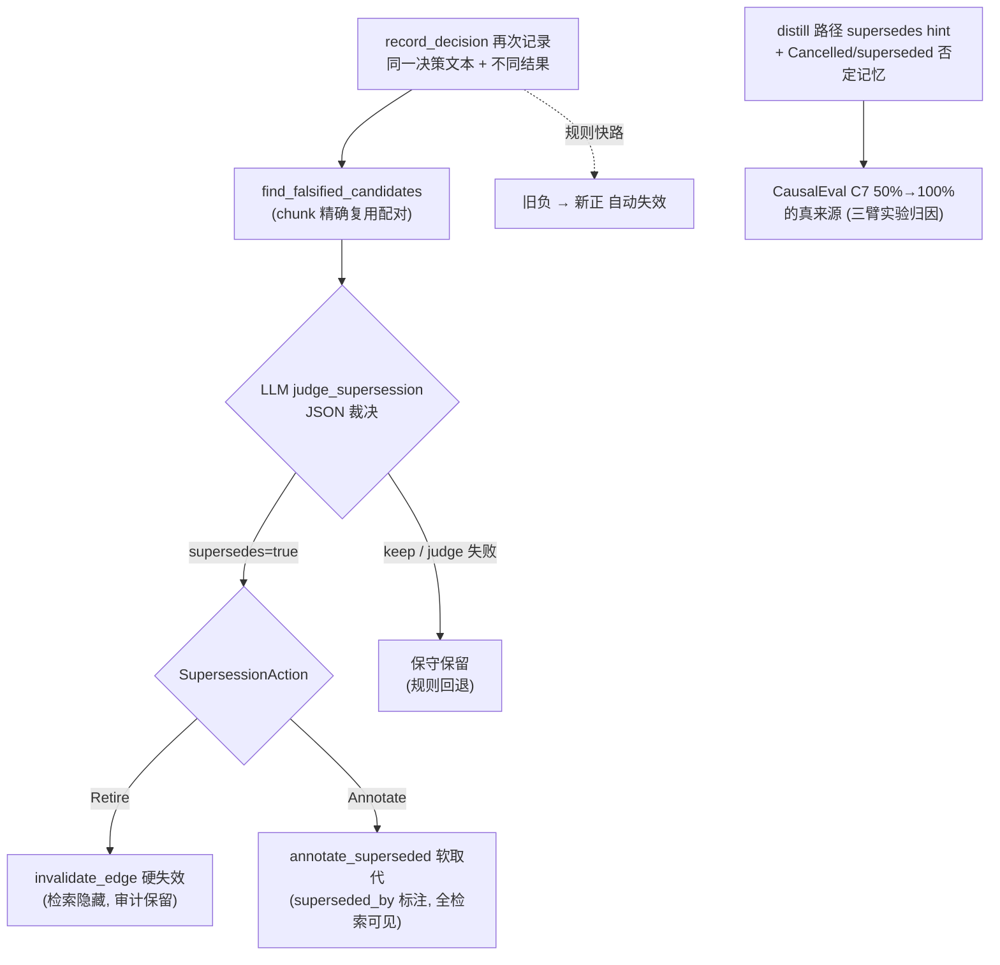
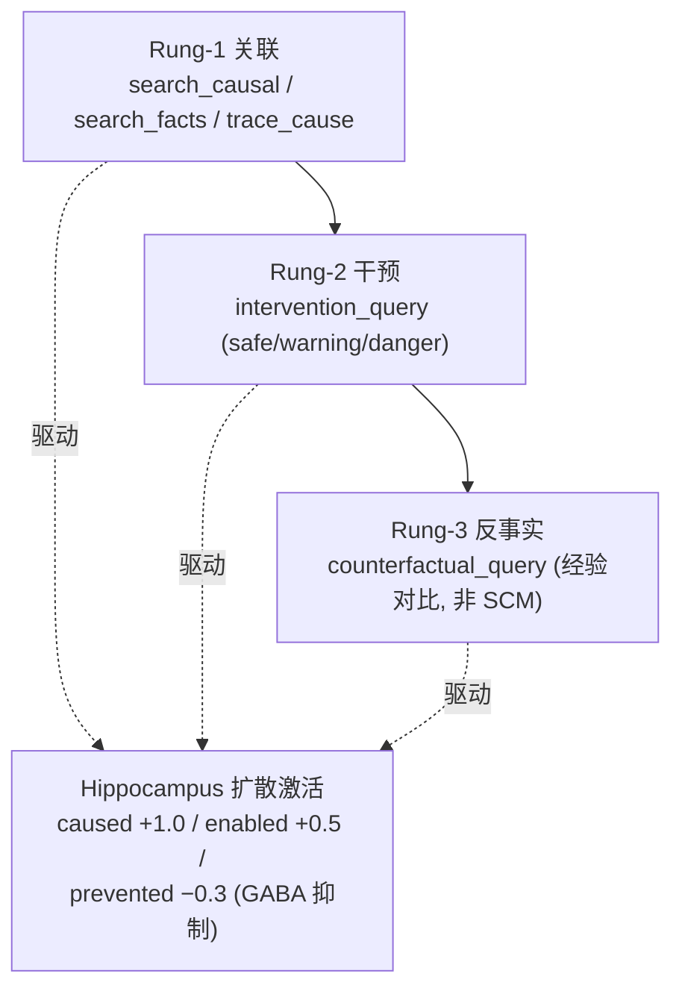
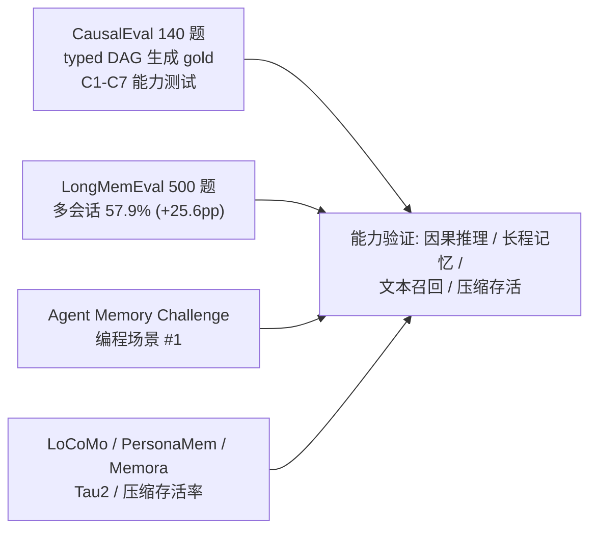

# 技术与算法全景

> GitHub 原生渲染 Mermaid（无需 HTML）。全部图均可编辑：改本文件后 GitHub 自动重绘。

## 1. 技术栈



## 2. 分层架构

```mermaid
flowchart TB
  subgraph Entry["入口层"]
    A1[Agent: Claude Code / Cursor / grok-build / HTTP]
    A2[MCP Server — 15 工具]
    A3[CLI: sleep / resolve-updates / ingest]
    A4[Python (PyO3) / DSH 插件 / Benchmarks]
  end
  subgraph Facade["Memory facade — 15+ ops"]
    F1[search_memory 融合检索]
    F2[search_memory_multi_pass 多遍检索]
    F3[trace / intervention / counterfactual / reconstruct]
    F4[record_decision / record_fact / remember]
  end
  subgraph Core["核心引擎"]
    S["Store SQLite v11<br/>WAL · 连接池 · 永不被压缩"]
    H["Hippocampus CausalGraph<br/>扩散激活 + 抑制 + Hebbian + Q-value"]
    R["Retrieval<br/>BM25 · 语义 · hop · RRF · 多遍"]
    C["Consolidation sleep<br/>0→4 阶段 + C7 supersession"]
  end
  subgraph X["横切智能"]
    X1[LLM 判官 + 蒸馏]
    X2[embed 共享 + LRU]
    X3[query_router / patterns / tokenizer]
  end
  A1 --> A2 & A3 & A4
  A2 --> Facade
  A3 --> Facade
  A4 --> Facade
  Facade --> S & H & R
  H --> S
  R --> S
  C --> S
  X1 --> Facade
  X2 --> R
  X3 --> Facade
```

## 3. 检索管线



## 4. 记忆巩固（sleep 周期）



## 5. 知识更新（C7）



## 6. 因果能力（Pearl 阶梯）



## 7. 评测矩阵


